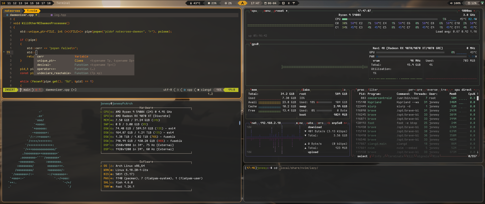

# My personal config files for linux
These are all of my config file I've used, this includes both X11 confs and and Wayland stuff and much more
The Wayland confs (Hyprland) is what I use now and is most updated and useable.
Feel free to use anything you like!

## Showcase

### Editors
* [Vim](https://github.com/jonesy-b-dev/LinuxConfigFiles/blob/main/.vimrc)
* [NeoVim](https://github.com/jonesy-b-dev/LinuxConfigFiles/tree/main/.config/nvim)

### Terminals
* [Foot](https://github.com/jonesy-b-dev/LinuxConfigFiles/blob/main/.config/foot/foot.ini)
* [Alacritty](https://github.com/jonesy-b-dev/LinuxConfigFiles/tree/main/.config/alacritty)
* [Tmux](https://github.com/jonesy-b-dev/LinuxConfigFiles/blob/main/.tmux.conf)

### Wayland
* [Hyprland](https://github.com/jonesy-b-dev/LinuxConfigFiles/blob/main/.config/hypr/hyprland.conf)
* [Hyprlock](https://github.com/jonesy-b-dev/LinuxConfigFiles/blob/main/.config/hypr/hyprlock.conf)
* [Hyprpaper](https://github.com/jonesy-b-dev/LinuxConfigFiles/blob/main/.config/hypr/hyprpaper.conf)
* [Waybar](https://github.com/jonesy-b-dev/LinuxConfigFiles/tree/main/.config/waybar)
* [Sway](https://github.com/jonesy-b-dev/LinuxConfigFiles/blob/main/.config/sway/config)
            
### X11
* [i3](https://github.com/jonesy-b-dev/LinuxConfigFiles/blob/main/.config/i3/config)
* [Polybar](https://github.com/jonesy-b-dev/LinuxConfigFiles/tree/main/.config/polybar)
* [Picom](https://github.com/jonesy-b-dev/LinuxConfigFiles/blob/main/.config/picom/picom.conf)

### Launchers
* [Rofi](https://github.com/jonesy-b-dev/LinuxConfigFiles/tree/main/.config/rofi)
* [ulauncher](https://github.com/jonesy-b-dev/LinuxConfigFiles/tree/main/.config/ulauncher)

## Shells
* [bash](https://github.com/jonesy-b-dev/LinuxConfigFiles/blob/main/.bashrc)
* [fish](https://github.com/jonesy-b-dev/LinuxConfigFiles/tree/main/.config/fish)
* [zhs](https://github.com/jonesy-b-dev/LinuxConfigFiles/blob/main/.zshrc)

## Other
* [Fastfetch](https://github.com/jonesy-b-dev/LinuxConfigFiles/blob/main/fastfetch/config.jsonc)
* [dunst](https://github.com/jonesy-b-dev/LinuxConfigFiles/tree/main/.config/dunst/dunstrc)
